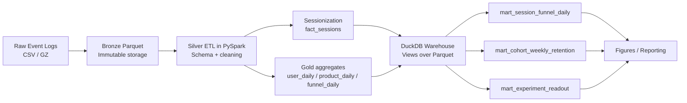

# Distributed Product Analytics & Experimentation Platform (E-Commerce Events)

This project builds an end-to-end product analytics pipeline on large-scale e-commerce event logs. The goal was to demonstrate the intersection of:

- **PySpark data engineering** (ETL + sessionization + partitioned lakehouse tables)
- **Warehouse analytics in SQL** (DuckDB marts for funnels and cohorts)
- **Experimentation analysis** (A/B assignment, SRM checks, lift + confidence intervals)
- **Analytics outputs** that look like what product and growth teams actually use

I picked this dataset because it forces the same real tradeoffs you see in production: noisy event logs, huge volume, session reconstruction, and metric definitions that have to be consistent across tables.

---

## Architecture



## Dataset
Source: multi-category online store event logs (Nov 2019 used in this run).
Each row represents an event such as view, cart, or purchase with identifiers for the user, product, and session.

## Pipeline Overview

### 1) Bronze: raw → partitioned Parquet
Why: keeping a bronze layer makes the pipeline repeatable. If downstream logic changes, I can rebuild silver/gold without touching the original input.

Input: `data/raw/2019-Nov.csv`
Output: `data/bronze/events/year=2019/month=11/...`

### 2) Silver: cleaned fact table (fact_events)
Why: analytics tables are only as good as the raw event hygiene. Silver is where schemas become stable, event types become canonical, and obvious corruption gets filtered.

Output: `data/silver/fact_events`

### 3) Silver: session reconstruction (fact_sessions)
Why: product funnels and engagement are often more stable and interpretable at the session level than the event level.

Session id: deterministic hash of (user_id, user_session)
Output: `data/silver/fact_sessions`

### 4) Gold: daily aggregates
Why: pushing heavy aggregation into Spark keeps the SQL layer lightweight and fast.

`data/gold/user_daily`
`data/gold/product_daily`
`data/gold/funnel_daily`

### 5) DuckDB warehouse + SQL marts
Why DuckDB: it gives a “warehouse feel” locally (SQL marts, reproducible queries) without needing a full cloud warehouse to demonstrate the modeling skill.
Views over Parquet:

* fact_events
* fact_sessions
* user_daily
* product_daily
* funnel_daily

Marts:

* mart_session_funnel_daily
* mart_cohort_weekly_retention
* mart_experiment_readout

### 6) Reporting / figures
Three outputs that summarize the product analytics story:

* cohort retention heatmap
* session funnel rates over time
* experiment lift with 95% CI (with SRM flag)

## Metrics (what the pipeline actually computes)

### `fact_sessions` (session-level)
- duration: `session_duration_s`
- volume: `num_events`
- stage counts: `n_view`, `n_cart`, `n_purchase`
- funnel flags: `has_view`, `has_cart`, `has_purchase`

### `mart_session_funnel_daily` (session funnel)
- counts: `sessions_total`, `sessions_with_view`, `sessions_with_cart`, `sessions_with_purchase`
- rates: `view_to_cart_rate`, `cart_to_purchase_rate`, `view_to_purchase_rate`

### `mart_cohort_weekly_retention` (cohorts)
- `cohort_size`, `active_users`, `retention_rate` by `week_index`

### `mart_experiment_readout` (A/B readout)
- conversion: `control_value`, `treatment_value`, `lift`, `ci_low`, `ci_high`
- validity: `srm_flag`, plus `control_n` / `treatment_n`
- revenue impact: `control_revenue_per_user`, `treatment_revenue_per_user`, `lift_revenue_per_user`

## Outputs (from this run)
Scale:

* 67.4M cleaned events (fact_events)
* 13.8M sessions (fact_sessions)
* Weekly cohort retention (Week 0–8)
* Session funnel conversion rates over time
* Experiment lift with 95% CI (+ SRM check)

## How to run (Windows / local)
Environment
This repo assumes PySpark is working locally (Java + Hadoop configured) and that you're running inside your prod-analytics conda environment.
I set these in PowerShell to avoid PySpark defaulting to a missing python3:

```powershell
$env:PYSPARK_PYTHON = (Get-Command python).Source
$env:PYSPARK_DRIVER_PYTHON = (Get-Command python).Source
```

### 1) Build lakehouse layers (PySpark)
```powershell
python src\spark\01_ingest_bronze.py --input data\raw\2019-Nov.csv --out data\bronze\events --repartition 8
python src\spark\02_clean_silver.py  --in_bronze data\bronze\events --out_silver data\silver\fact_events --repartition 8
python src\spark\03_sessions.py      --in_events data\silver\fact_events --out_sessions data\silver\fact_sessions --repartition 8
python src\spark\04_features_user_product.py --in_events data\silver\fact_events --out_gold data\gold --repartition 8
```

### 2) Build SQL marts (DuckDB)
```powershell
python scripts\run_duckdb.py
```

### 3) Generate figures
```powershell
python scripts\make_figures.py
```

## Notes on design choices (brief)
I separated bronze/silver/gold because it makes debugging and iteration easier. It’s also the closest thing to “production discipline” you can show in a local project.
I used session-based funnels because event-level funnels can be misleading (a purchase can happen without an explicit cart event). Sessions give a cleaner unit for conversion.
The experiment is simulated, but it still checks the two things that matter in real pipelines: balanced assignment (SRM) and reporting a confidence interval instead of just a point estimate.

## Data quality checks
* **Deterministic Session Hashing:** Asserted uniqueness on the composite key `(user_id, user_session)` to prevent catastrophic row explosion during downstream dimensional joins.
* **Orphaned Event Filtering:** Dropped events with missing user or session IDs at the silver layer, ensuring denominator integrity for cohort retention calculations.
* **Chronological Enforcement:** Filtered out-of-order and late-arriving timestamps that violated the expected monthly partition boundaries before pushing to the gold layer.
* Quality reports are written to `reports/quality_silver_events.json` and `reports/quality_silver_sessions.json`.

## Common pitfalls I guarded against
* **Event-Level vs. Session-Level Funnels:** Raw event-level funnels often hallucinate drop-offs (e.g., a user triggers a 'purchase' event without a recorded 'cart' event due to telemetry packet drops). I enforced sessionization first to provide a robust, stateful denominator for conversion rates.
* **Sample Ratio Mismatch (SRM):** In the simulated A/B test assignment, I implemented an explicit chi-squared test for SRM. If the hash-based traffic split deviates significantly from the expected 50/50 allocation, the pipeline flags the experiment readout as invalid rather than silently reporting lift.

